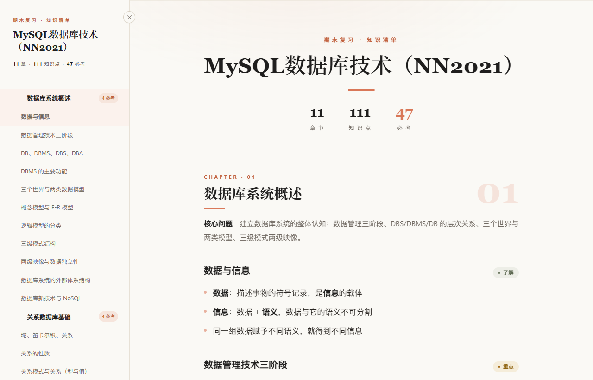
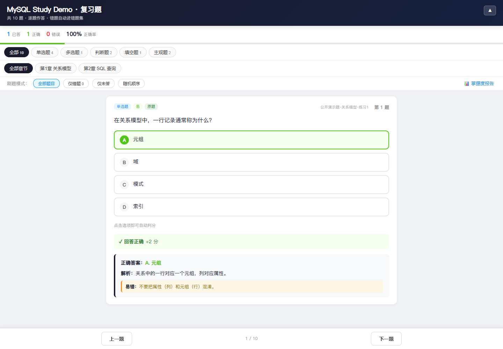
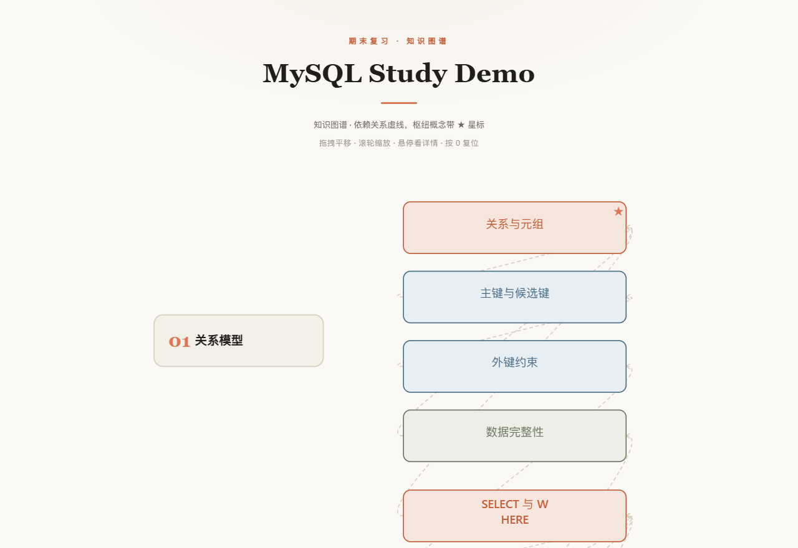

# exam-kit

> 把散落的期末课件，变成能背、能刷、能看懂依赖关系的三份离线复习工具。
> Turn scattered course slides into three offline review tools — printable, no CDN, no API.

`exam-kit` reads your PPT / Word / PDF / slide photos and produces three **self-contained HTML files** you can open anywhere, print to PDF, and keep offline. 老师给的课件和复习资料 → 三份可打印、可自测的单文件 HTML。

| 产物 | 你拿它做什么 | 预览 |
|---|---|---|
| **复习提纲** | 按章背诵，知识点打四色重要度标签，章末折叠自测 | [](showcase/preview/outline.png) |
| **复习题** | 逐题作答、自动批改、逐题解析、错题集、掌握度报告 | [](showcase/preview/quiz.png) |
| **知识图谱** | 章节→知识点 + 依赖虚线 + 枢纽概念星标，拖拽缩放 | [](showcase/preview/graph.png) |

[](LICENSE)
[](requirements.txt)
[](https://github.com/Tissue-for-charlie/exam-kit/actions/workflows/verify.yml)

## 3 分钟看见结果

先跑确定性 demo（不联网、不调用模型、不读取你的课程目录，只渲染仓库内公开演示数据）：

```bash
python -m pip install -r requirements.txt
python showcase/build_showcase.py
```

用浏览器打开 `showcase/output/` 下的三个 HTML 即可体验全部交互。验证摘要写入 `showcase/verification.json`（产物大小 + SHA-256 + 统计），结构契约在 `showcase/expected/`。

## 装成一个 Agent Skill

本仓库遵循 [Agent Skills 开放规范](https://agentskills.io/specification)：`SKILL.md` 位于仓库根，`name: exam-kit` 与目录同名。

**方式一 · skills.sh 一条命令**（支持 Claude Code / Codex / Cursor / OpenClaw 等）：

```bash
npx skills add Tissue-for-charlie/exam-kit
```

**方式二 · 手动放置**：把整个仓库放进你所用 Agent 的 skill 目录，`SKILL.md` 与 `scripts/` 保持同级即可。

- Claude Code：`~/.claude/skills/exam-kit/`（全局）或项目内 `.claude/skills/exam-kit/`
- Codex / OpenClaw / 其他：按其各自的 skill 目录约定放置

装完这样说：

```text
请用 exam-kit 处理这门课的 PPT、PDF 和 Word 资料：先扫描并按章节分组，再提取文字；随后生成知识骨架和原题清单；最后输出复习提纲、复习题和知识图谱三份离线 HTML。原题请保留来源，无法从资料确认的内容请明确标注。
```

也直接说这些话触发它：

- “帮我整理这门课的期末复习资料。”
- “根据这些课件生成复习提纲和自测题。”
- “把这几份 PDF、PPT 和板书照片按章节整理。”
- “划出必考点，并给每个知识点配题。”
- “做一张这门课的知识依赖图。”

## 它和同类有什么不同？

| | 一般“课件转笔记” | **exam-kit** |
|---|---|---|
| 产物形态 | 一份笔记/文档 | **三种形态**：背诵用提纲 + 交互判分题库 + 依赖图谱，均为可打印离线 HTML |
| 题目出处 | AI 直接编 | 优先复用资料里的原题（例题/课后题/真题），每题标注 `original`/`generated` 与出处，**不编造来源** |
| 可验证性 | 跑完即走 | 公开 demo 确定性重建：产物 SHA、PII 扫描、schema 校验，README 三张预览可复现重录 |

它把“脚本干提取渲染的机械活、Agent 干理解命题的智力活”分开：需要多模态读图、需要读全文提炼骨架的部分由 Agent 完成，但步骤、中间产物与产物契约都是明确、可校验的。

## 它实际怎么工作

```text
课程资料
  → scan.py：扫描并按章节分组
  → extract.py：提取文字，记录图片供多模态 Agent 阅读
  → Agent：整理知识骨架、抽取原题、补齐题目并标注来源
  → render_outline.py / render_quiz.py / render_graph.py
  → 三份单文件 HTML
```

图片不做 OCR：图片和 PPT 内嵌图片会记录路径，交给支持视觉输入的 Agent 直接读。

## 公开 demo 与真实课程的边界

`showcase/fixture/course.json` 是独立措辞的 **derived demo**，不是任何真实课程的副本。它不包含真实课件、原图、连续课件原文、教师/学校/学生信息或本地路径。

公开构建只证明“已准备的知识骨架和题库 → 三份离线 HTML”的确定性渲染链路。真实课程的完整流程由 Agent 根据用户提供的资料完成；`showcase/build_showcase.py` 不接受任意输入路径、不读取真实课程目录，也不自动脱敏后发布资料。

## 处理真实资料

对真实课程资料，Agent 会按以下路径工作：

```bash
python <skill目录>/scripts/scan.py "<资料目录>"
python <skill目录>/scripts/extract.py "<资料目录>"
# Agent 读取 .final_prep 中间结果并生成 knowledge_skeleton.json / questions.json
python <skill目录>/scripts/render_outline.py "<资料目录>"
python <skill目录>/scripts/render_quiz.py "<资料目录>"
python <skill目录>/scripts/render_graph.py "<资料目录>"
```

首次使用安装依赖：

```bash
python -m pip install -r requirements.txt
```

传统二进制 `.ppt` 可能无法由 `python-pptx` 读取，建议先转换为 `.pptx`；扫描版 PDF 无文字层时需要由 Agent 直接阅读。某一步脚本失败不阻断流程——Agent 会改用 Read 工具直接读文件继续。

## 安全边界

- 不自动上传课程资料，不调用外部 API。
- 不自动删除或覆盖真实资料文件。
- 公开 showcase 不接受任意输入路径，避免误读私人目录。
- `original` 只用于资料中确实存在且可独立作答的题目。
- 公开 fixture 和生成 HTML 会检查常见邮箱、手机号、绝对路径、秘密字段和外部网络依赖。
- 自动检查不是版权授权替代品；真实课件能否公开仍由使用者确认。

## 文件结构

```text
SKILL.md                         # Agent 工作流、JSON 契约和触发说明
scripts/                         # 扫描、提取和三种 HTML renderer
showcase/
├── fixture/course.json          # 独立措辞的公开演示数据（骨架 + 题库 schema 范本）
├── build_showcase.py            # 确定性构建 + PII/静态安全校验 → showcase/output
├── screenshot_showcase.py       # 重录 README 三张预览图 → showcase/preview
├── preview/*.png                # README 首屏产物预览（已入库）
├── expected/                    # verification.json 结构契约
└── output/                      # 构建产物（gitignore，不提交）
tests/                           # 构建回归 + 可选浏览器验收
```

## 验证

```bash
python -m py_compile showcase/*.py scripts/*.py tests/*.py
python showcase/build_showcase.py
python -m unittest discover -s tests -v
python -m json.tool showcase/fixture/course.json
python tests/browser_showcase.py          # 可选：本机 Playwright + Chromium
python showcase/screenshot_showcase.py    # 可选：重录 README 预览图
```

浏览器/截图验收只使用本机已有的 Playwright/Chromium，不会自动下载浏览器；没有可用浏览器时会如实报告 `unavailable`。CI（`.github/workflows/verify.yml`）在 Ubuntu 与 Windows 上跑编译、构建与全部测试。Windows 上若个别命令输出乱码，先设 `PYTHONUTF8=1` 再运行。

## License

[MIT](LICENSE)
